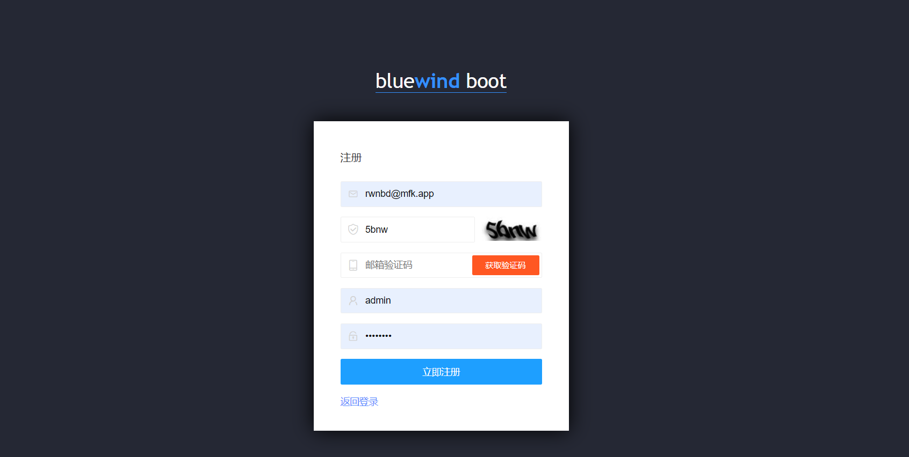

# bluewind-boot

<a href='https://gitee.com/leisureLXY/bluewind-boot/stargazers'></img></a>
<a href='https://gitee.com/leisureLXY/bluewind-boot/members'></img></a>

### 项目介绍
📚bluewind-boot 一个基于SpringBoot + MyBatis + Thymeleaf 的后台通用权限管理系统，代码简洁易懂、界面美观大方，内部封装了权限管理系统常用的功能，可直接作为快速开发JavaWeb项目的脚手架使用。

### 演示地址
01.  地址：<a target="_blank" href="http://101.43.9.251:8088/bluewind/admin/login">http://101.43.9.251:8088/bluewind/admin/login</a>
01.  账户：admin
01.  密码：123456a?

### 技术选型
- SpringBoot2
- thymeleaf 模板引擎
- Quartz 分布式定时任务调度方案
- druid 德鲁伊连接池
- mybatis 持久层框架
- pagehelper mybatis分页插件
- knife4j swagger-ui接口文档美化方案
- itextpdf pdf处理工具包
- redisson redis分布式锁工具包
- anji-plus anji-plus行为验证码工具包
- LayUI 前端框架，官方文档：https://layuion.com/
- layuimini 前框模板，官方文档：https://gitee.com/zhongshaofa/layuimini
- minio 对象存储

### 运行环境
- jdk8
- Mysql5.6+
- redis3.0+

### 启动教程

01.  新建数据库并导入sql文件夹下的数据库脚本到MySQL
02.  修改application-dev.yml中MySQL数据库的连接信息
04.  修改application-dev.yml中Redis（包括redisson）的连接信息
05.  运行启动类BluewindBootApplication，即可正常启动项目

### 内置功能
权限管理
01.  用户登录：用户输入账户密码登录系统
02.  用户注册：用户根据邮箱和验证码可进行系统用户注册
03.  部门管理：维护系统内的部门组织架构树
04.  岗位管理：维护岗位类型赋予用户
05.  用户管理：用户是系统操作者，该功能主要完成系统用户信息配置
06.  角色管理：角色菜单权限分配
07.  菜单管理：配置系统菜单，操作权限，按钮权限标识等

系统设置
01.  数据字典：对系统中经常使用的一些较为固定的数据进行维护
02.  业务流水号：配置生成指定规则的业务流水号
03.  网站配置：配置网站信息
04.  定时任务调度：基于Qurtaz 在线（添加、修改、删除)任务调度包含执行结果日志
04.  业务规则管理：管理系统业务规则信息(通用配置)

系统监控
01.  Druid监控：通过Druid监视当前系统数据库连接池状态
02.  登录日志：对每个用户的登录信息进行监控，获取用户的 IP，地理位置等信息
03.  操作日志：通过自定义注解，对用户的操作进行记录
04.  服务器监控：监视当前系统CPU、内存、磁盘、堆栈等相关信息
05.  在线用户监控：监控系统当前在线用户

邮件服务
01.  邮件发送：邮件发送共有五种方式，文本、HTML、图片、附件、模板

itfc服务管理
01.  服务秘钥：给itfc服务使用方颁发秘钥，用于访问服务时鉴权
02.  服务权限：给不同的秘钥分配不同的接口权限，保证接口的安全性

### 页面展示

### bluewind-boot

